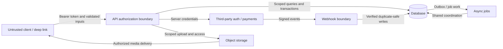

# Security & Architecture Audit Framework

Version **1.0.0** · Canonical data: [checklist.json](../tools/audit/src/features/audit/checklist.json)

This framework contains 54 review questions across eight topics. The requested sample topic counts totaled 60; this version reconciles them to the explicit 54-question acceptance criterion: auth 7, validation 8, crypto 6, API 7, frontend 6, infrastructure 7, observability 7, performance 6. Rule types are independent of topics.

## Evidence and decisions

Start every item unchecked. Use in-progress while collecting proof, passed only after the stated verification succeeds, and failed with a specific finding. An automated source scan is evidence of a pattern, not proof of authorization, signature correctness or idempotency. Missing files, unavailable environments and manual-review flags remain unresolved, never automatic passes. Record commit, environment, reviewer, time and evidence links. Critical/High failed release gates block release; unresolved Critical/High controls require completed review before a release decision. Medium/Low findings remain visible with owners and due dates.

Repository paths are starting points, not claims that the controls already pass. This Expo application uses `apiclient/`, not the illustrative `src/api/` path in the brief. Native token storage uses SecureStore; web storage requires separate review. UI-only changes cannot enforce server permissions. Review current behavior against [AUDIT_STANDARD.md](AUDIT_STANDARD.md) and record conflicts explicitly.

## Threat model and trust boundaries

Map the actual trigger → API → database → webhook/job → provider/storage → final UI state for each changed flow. Record the actor, data owner, enforcement check, retry behavior and evidence at every boundary.

| Threat               | Negative verification                                                    | Checklist                                     |
| -------------------- | ------------------------------------------------------------------------ | --------------------------------------------- |
| Auth bypass          | Missing, expired and revoked tokens cannot perform protected work        | [auth-bypass](#auth-bypass)                   |
| Privilege escalation | Unrelated actors cannot change role, plan or ownership                   | [privilege-escalation](#privilege-escalation) |
| Payment spoofing     | Forged client success does not grant paid state                          | [payment-spoofing](#payment-spoofing)         |
| IDOR                 | Swapping object IDs cannot expose or mutate another actor’s private data | [idor](#idor)                                 |
| Webhook replay       | Concurrent duplicate events produce one correct final state              | [webhook-replay](#webhook-replay)             |
| Stale cache          | Privacy, payment and role changes take effect across cache layers        | [stale-cache](#stale-cache)                   |
| Deep-link abuse      | Malformed or unauthorized links fail safely                              | [deep-link-abuse](#deep-link-abuse)           |

## Running verification

Use the exact relevant tests and deployment evidence listed below. Existing entry points include `npm run typecheck`, `npm run lint`, `npm run test:regressions`, `npm --prefix server run test:invariants`, and `npm --prefix server run test:payments:confidence`. Run from the repository root. A test name without a command identifies a fixture to run with the package’s Jest runner; verify it exists before relying on it. Capture failed commands and environmental blockers honestly. Use [the finding template](../templates/AUDIT_REPORT.md) for reproducible evidence.

## Audit Steps

Reviewer actions that investigate a concrete risk.

### Are login and recovery attempts rate-limited across replicas?

**login-rate-limit · auth · High**

Distributed limits must bound guessing without exposing account existence.

**How we verify this passed:** Send repeated invalid logins and resets against two replicas; record rejection thresholds and Redis outage behavior.

**Inspect:** [server/src/middleware/rateLimiters.ts](../server/src/middleware/rateLimiters.ts), [server/src/lib/redisRateLimit.ts](../server/src/lib/redisRateLimit.ts), [server/src/routes/auth.ts](../server/src/routes/auth.ts)

**Remediation:** Use shared rate limits and generic account recovery responses.

### Do sensitive operations require appropriate reauthentication?

**sensitive-reauth · auth · High**

Document the threat-based MFA or recent-authentication requirement for admin, credential and deletion operations.

**How we verify this passed:** Exercise stale sessions on sensitive actions; attach evidence of reauthentication or an explicit reviewed gap.

**Inspect:** [server/src/routes/auth.ts](../server/src/routes/auth.ts), [server/src/routes/admin.ts](../server/src/routes/admin.ts)

**Remediation:** Require recent authentication or MFA appropriate to the operation; track unsupported controls as unresolved.

### Are database and command operations injection-safe?

**injection · validation · Critical**

Parameterized access must cover raw queries and dynamic identifiers as well as ordinary Prisma calls.

**How we verify this passed:** Review raw SQL and subprocess call sites; probe attacker-controlled strings and identifier allowlists.

**Inspect:** `server/src/routes/**`, `server/src/lib/**`, [server/prisma/schema.prisma](../server/prisma/schema.prisma)

**Remediation:** Parameterize values and explicitly allowlist identifiers; avoid shell interpolation.

### Are keys and credentials rotated with an owner?

**secret-rotation · crypto · High**

Rotation must cover database, signing and provider credentials with a tested transition.

**How we verify this passed:** Attach redacted rotation records, owner and next due date; exercise old-key rejection in a safe environment.

**Inspect:** [server/src/lib/jwt.ts](../server/src/lib/jwt.ts), [docs/PRE_RELEASE_CONFIG_VERIFICATION.md](../docs/PRE_RELEASE_CONFIG_VERIFICATION.md)

**Remediation:** Document rotation ownership and overlapping key rollout where needed.

### Is sensitive persisted data encrypted and access-restricted?

**at-rest · crypto · High**

Database, object storage and backups need verified encryption and least-privilege access.

**How we verify this passed:** Attach redacted provider encryption settings and access review; verify backup encryption configuration.

**Inspect:** [server/prisma/schema.prisma](../server/prisma/schema.prisma), [docs/BUSINESS_CONTINUITY.md](../docs/BUSINESS_CONTINUITY.md)

**Remediation:** Enable encryption with controlled key access and restrict data roles.

### Are public and internal network surfaces restricted?

**network-controls · infra · High**

Confirm ingress, database exposure and WAF or equivalent abuse controls against deployment evidence.

**How we verify this passed:** Attach firewall/edge policy evidence and test denied access to internal services from an external network.

**Inspect:** [docs/PRE_RELEASE_CONFIG_VERIFICATION.md](../docs/PRE_RELEASE_CONFIG_VERIFICATION.md)

**Remediation:** Restrict service ingress and configure abuse protections for exposed endpoints.

### Do anomaly alerts reach an accountable responder?

**actionable-alerts · observability · High**

Auth spikes, payment failures and job failures need actionable thresholds and routing.

**How we verify this passed:** Trigger a safe test alert and record receipt, owner and linked response procedure.

**Inspect:** `server/src/cron/**`, [docs/BUSINESS_CONTINUITY.md](../docs/BUSINESS_CONTINUITY.md)

**Remediation:** Configure signal-specific thresholds and test delivery to the on-call owner.

### Is security-log retention defined and verified?

**log-retention · observability · Medium**

Verify the requested 90-day security retention target against minimization and access policy.

**How we verify this passed:** Attach configured retention evidence and an old-event retrieval test; record approved deviations explicitly.

**Inspect:** [server/src/middleware/logging.ts](../server/src/middleware/logging.ts), [docs/BUSINESS_CONTINUITY.md](../docs/BUSINESS_CONTINUITY.md)

**Remediation:** Set documented retention, access and deletion policies with reviewed exceptions.

### Are slow database operations measured?

**query-monitoring · performance · Medium**

Collect representative latency and query behavior for critical endpoints without logging sensitive values.

**How we verify this passed:** Capture staging query timing and endpoint percentiles under representative load; compare to stated budgets.

**Inspect:** [server/src/lib/prisma.ts](../server/src/lib/prisma.ts), [server/src/routes/feed.ts](../server/src/routes/feed.ts), [server/src/routes/games.ts](../server/src/routes/games.ts)

**Remediation:** Instrument slow queries and optimize measured bottlenecks.

### Are list endpoints bounded and free of avoidable N+1 queries?

**n-plus-one · performance · Medium**

Query count and memory should remain bounded as lists grow.

**How we verify this passed:** Measure query counts at page sizes 1, 10 and the maximum; verify indexed filters and pagination.

**Inspect:** [server/src/routes/feed.ts](../server/src/routes/feed.ts), [server/src/routes/games.ts](../server/src/routes/games.ts), [server/prisma/schema.prisma](../server/prisma/schema.prisma)

**Remediation:** Batch related lookups, use suitable indexes and enforce pagination.

## Engineering Standards

Testable rules for structuring and operating code.

### Are passwords protected by adaptive hashing?

**password-hashing · auth · Critical**

Password and reset flows must use reviewed adaptive hashing parameters.

**How we verify this passed:** Inspect every bcrypt.hash call in registration, reset, change-password and OAuth bootstrap; test correct and incorrect passwords.

**Inspect:** [server/src/routes/auth.ts](../server/src/routes/auth.ts)

**Remediation:** Centralize the password cost policy and migrate weak hashes on successful authentication.

### Do frontend and backend validation contracts agree?

**validation-drift · validation · High**

Backend validation is authoritative; intentional UX differences need explicit documentation.

**How we verify this passed:** Compare apiclient schemas and changed forms against server schemas; run validation-consistency and validation-parity tests.

**Inspect:** `apiclient/schemas/**`, `server/src/routes/**`, [**tests**/validation-consistency.test.ts](../__tests__/validation-consistency.test.ts), [server/src/**tests**/validation-parity.test.ts](../server/src/__tests__/validation-parity.test.ts)

**Remediation:** Share safe schemas or add parity cases for boundaries and malformed values.

### Is untrusted content safely rendered?

**output-encoding · validation · High**

Public HTML and web surfaces must encode user content and use suitable response security policies.

**How we verify this passed:** Insert HTML payloads in rendered fields; inspect public route responses and production CSP without executing untrusted scripts.

**Inspect:** [server/src/routes/shareLanding.ts](../server/src/routes/shareLanding.ts), [server/src/routes/publicSite.ts](../server/src/routes/publicSite.ts), [server/src/routes/og.ts](../server/src/routes/og.ts)

**Remediation:** Escape output by context and restrict unsafe markup and scripts.

### Are request size and collection limits bounded?

**payload-limits · validation · High**

Bound payloads, pagination and batch operations before expensive processing.

**How we verify this passed:** Inspect server parser limits and submit oversized JSON, uploads and pagination values; record safe failures.

**Inspect:** [server/src/index.ts](../server/src/index.ts), `server/src/routes/**`

**Remediation:** Apply parser limits, bounded page sizes and workload-specific rate limits.

### Are session credentials stored safely on each platform?

**secure-token-storage · crypto · High**

Native credentials require SecureStore; browser credential persistence needs a separately reviewed threat model.

**How we verify this passed:** Inspect native and web branches in auth storage and test storage failure and reinstall recovery.

**Inspect:** [apiclient/auth.ts](../apiclient/auth.ts), [apiclient/http.ts](../apiclient/http.ts), [apiclient/**tests**/auth-storage-recovery.test.ts](../apiclient/__tests__/auth-storage-recovery.test.ts)

**Remediation:** Keep native tokens in secure storage; remove unsafe browser persistence and fail closed on storage errors.

### Is cross-origin access limited to intended clients?

**cors · api · High**

CORS policy must specify trusted browser origins without treating CORS as authentication.

**How we verify this passed:** Test allowed and untrusted Origin headers, including preflight and credentialed requests.

**Inspect:** [server/src/index.ts](../server/src/index.ts)

**Remediation:** Use an explicit environment-specific origin allowlist.

### Are error responses sanitized and actionable?

**safe-errors · api · Medium**

Responses must omit secrets, stack traces and internal paths while retaining safe diagnostic references.

**How we verify this passed:** Trigger validation, authorization and server errors; inspect responses and correlated redacted logs.

**Inspect:** [server/src/middleware/errorHandler.ts](../server/src/middleware/errorHandler.ts), [apiclient/http.ts](../apiclient/http.ts)

**Remediation:** Centralize safe error formatting with correlation identifiers.

### Are API contract changes compatible with supported clients?

**api-contract · api · Medium**

Mobile releases may lag the server; version or migrate breaking request and response changes.

**How we verify this passed:** Compare changed schemas to previous supported clients and run contract fixtures; record compatibility window.

**Inspect:** `apiclient/schemas/**`, `server/src/routes/**`

**Remediation:** Use additive changes or explicit versioned migration with deprecation dates.

### Do routes delegate shared policy and networking?

**thin-routes · api · Medium**

Keep routing wrappers small and reusable policy in shared modules; clients use apiclient transport.

**How we verify this passed:** Review changed app wrappers and raw fetch calls; document approved transport exceptions with reasons.

**Inspect:** `app/**`, [apiclient/http.ts](../apiclient/http.ts), `server/src/lib/**`

**Remediation:** Move duplicate policy into shared helpers and network calls into apiclient.

### Do asynchronous screens show loading, empty, success and error states?

**async-ui · frontend · Medium**

Users need clear recovery without duplicate submissions or stale effects after unmount.

**How we verify this passed:** Exercise slow, failed and empty responses, double submissions and navigation during requests.

**Inspect:** `app/**`, `components/**`, [apiclient/http.ts](../apiclient/http.ts)

**Remediation:** Add explicit state handling, submission guards and cancellation or mounted checks.

### Are critical controls usable with keyboard and assistive technology?

**accessible-controls · frontend · Medium**

Names, focus, text status and adequate targets must communicate actions without color alone.

**How we verify this passed:** Use keyboard and screen reader on login, payments and audit flows; inspect focus and announced statuses.

**Inspect:** `app/**`, `components/**`, `tools/audit/src/**`

**Remediation:** Add accessible labels, visible focus and text status; restore focus after transitions.

### Is persisted client state limited and isolated by identity?

**local-state · frontend · High**

Feature-local progress can persist locally; sensitive authority and previous-user data cannot be trusted.

**How we verify this passed:** Switch accounts and corrupt or exhaust storage; verify reset, validation and a visible recovery path.

**Inspect:** [apiclient/auth.ts](../apiclient/auth.ts), `context/**`, `tools/audit/src/**`

**Remediation:** Validate stored data, scope caches by account and keep security decisions server-owned.

### Are database credentials restricted and externally managed?

**database-credentials · infra · Critical**

Runtime credentials should have only needed privileges and stay out of tracked configuration.

**How we verify this passed:** Inspect redacted deployment bindings and database role grants; verify repository secret scan.

**Inspect:** [server/src/lib/prisma.ts](../server/src/lib/prisma.ts), [server/prisma/schema.prisma](../server/prisma/schema.prisma), [.github/workflows/secret-scan.yml](../.github/workflows/secret-scan.yml)

**Remediation:** Use secret-managed credentials, restricted roles and rotation.

### Is deployment configuration versioned and reviewed?

**deployment-config · infra · Medium**

Runtime, build and environment changes require review and reproducible configuration.

**How we verify this passed:** Compare deployed settings to versioned configuration; record any provider-only settings and owner.

**Inspect:** [eas.json](../eas.json), [.github/workflows/deploy-guard.yml](../.github/workflows/deploy-guard.yml), [docs/PRE_RELEASE_CONFIG_VERIFICATION.md](../docs/PRE_RELEASE_CONFIG_VERIFICATION.md)

**Remediation:** Version non-secret configuration and document external setting changes.

### Is cross-replica coordination durable?

**replica-coordination · infra · High**

Locks, dedupe and rate limits need shared state and defined outage behavior.

**How we verify this passed:** Run concurrent operations on two replicas and simulate shared-store loss; assert no duplicate critical effects.

**Inspect:** [server/src/lib/redisRateLimit.ts](../server/src/lib/redisRateLimit.ts), [server/src/lib/cache.ts](../server/src/lib/cache.ts), [server/src/routes/payments.ts](../server/src/routes/payments.ts)

**Remediation:** Use Redis or database coordination with bounded locks and safe failure handling.

### Are security-relevant failures observable?

**security-events · observability · High**

Auth failures, validation rejection and blocked privileged actions need useful redacted telemetry.

**How we verify this passed:** Trigger synthetic failures and find their timestamp, action and correlation ID in collected logs.

**Inspect:** [server/src/middleware/auth.ts](../server/src/middleware/auth.ts), [server/src/middleware/logging.ts](../server/src/middleware/logging.ts)

**Remediation:** Emit structured security events without tokens or unnecessary personal data.

### Are asset caches efficient and privacy-safe?

**asset-caching · performance · Medium**

Cache public immutable media appropriately while preventing shared caches from leaking private responses.

**How we verify this passed:** Inspect CDN and API Cache-Control behavior for public assets and authenticated content after logout.

**Inspect:** [server/src/routes/uploads.ts](../server/src/routes/uploads.ts), [server/src/routes/og.ts](../server/src/routes/og.ts), [apiclient/http.ts](../apiclient/http.ts)

**Remediation:** Set explicit public/private cache policy and version immutable asset URLs.

### Are expensive screens and assets loaded on demand?

**lazy-loading · performance · Low**

Measure route startup and defer nonessential work while keeping loading and error states accessible.

**How we verify this passed:** Profile a production build on a representative device and inspect eager imports on primary routes.

**Inspect:** `app/**`, `components/**`

**Remediation:** Defer heavy optional modules and media based on measured startup cost.

## Business Rules

Product invariants enforced by trusted server state.

### Are role, ownership and plan checks enforced by the server?

**privilege-escalation · auth · Critical**

Persisted authority controls admin, organization and team operations. Hidden UI is not authorization.

**How we verify this passed:** Attempt each changed privileged action as fan, unrelated coach and non-owner; assert denial and no write.

**Inspect:** [server/src/middleware/requireAdmin.ts](../server/src/middleware/requireAdmin.ts), [server/src/middleware/subscription.ts](../server/src/middleware/subscription.ts), [server/src/routes/organizations.ts](../server/src/routes/organizations.ts), [server/src/routes/teams.ts](../server/src/routes/teams.ts)

**Remediation:** Resolve authority from persisted membership and shared server policy.

### Is third-party identity verified before account linking?

**oauth-linking · auth · Critical**

Provider identity, audience and ownership must be verified before linking an account.

**How we verify this passed:** Run npm --prefix server run test:invariants and negative tests for wrong audience, issuer and existing linked accounts.

**Inspect:** [server/src/lib/oauthVerification.ts](../server/src/lib/oauthVerification.ts), [server/src/lib/oauthAccountLinking.ts](../server/src/lib/oauthAccountLinking.ts)

**Remediation:** Verify provider assertions server-side and reject ambiguous ownership.

### Can only trusted server logic set critical state?

**critical-state · validation · Critical**

Payment, approval, ownership, plan and privileged role fields cannot be client-authored.

**How we verify this passed:** Submit protected fields through create, update and onboarding routes; compare persisted state before and after.

**Inspect:** [server/src/routes/users.ts](../server/src/routes/users.ts), [server/src/routes/ads.ts](../server/src/routes/ads.ts), [server/src/routes/payments.ts](../server/src/routes/payments.ts), [server/src/routes/organizations.ts](../server/src/routes/organizations.ts)

**Remediation:** Allowlist mutable fields and derive privileged state from trusted records.

### Are uploads checked before they become accessible?

**upload-validation · validation · High**

Validate actual media type, size, ownership and scanning or moderation policy; client metadata is untrusted.

**How we verify this passed:** Upload disallowed, oversized and mismatched-content fixtures; confirm denial and inaccessible rejected objects.

**Inspect:** [server/src/routes/uploads.ts](../server/src/routes/uploads.ts), [apiclient/upload.ts](../apiclient/upload.ts)

**Remediation:** Enforce server media validation and quarantine or reject unverified objects.

### Do privacy, blocking and minor-safety rules fail closed?

**minor-privacy · validation · Critical**

Age, consent, blocking and private resource policies must apply to reads, writes and media access.

**How we verify this passed:** Exercise adult/minor, blocked-user and private-team combinations; verify denied messages and no hidden data in responses.

**Inspect:** [server/src/lib/userAge.ts](../server/src/lib/userAge.ts), [server/src/lib/privacyUtils.ts](../server/src/lib/privacyUtils.ts), [server/src/routes/messages.ts](../server/src/routes/messages.ts), [server/src/routes/follows.ts](../server/src/routes/follows.ts)

**Remediation:** Reuse server privacy and age policies for every access path.

### Is paid state confirmed independently by the server?

**payment-spoofing · api · Critical**

Success URLs, local purchase state and client payloads cannot grant entitlements.

**How we verify this passed:** Forge success/deep-link parameters and receipt payloads; verify no paid state until provider verification succeeds.

**Inspect:** [server/src/routes/payments.ts](../server/src/routes/payments.ts), [server/src/services/payments/googlePlayVerifier.ts](../server/src/services/payments/googlePlayVerifier.ts), [utils/stripe.tsx](../utils/stripe.tsx)

**Remediation:** Reconcile payment state from verified provider data and return authoritative status.

### Do cache invalidations preserve privacy and current authority?

**stale-cache · performance · High**

Account, block, approval and payment transitions must invalidate affected cache entries.

**How we verify this passed:** Run games-cache-invalidation, users-follow-cache-invalidation and auth-me-cache-invalidation server tests; verify changed flows.

**Inspect:** [server/src/lib/cache.ts](../server/src/lib/cache.ts), [apiclient/auth.ts](../apiclient/auth.ts), [server/src/**tests**/auth-me-cache-invalidation.test.ts](../server/src/__tests__/auth-me-cache-invalidation.test.ts)

**Remediation:** Invalidate or version affected caches and recheck authorization on sensitive reads.

## Release Gates

Explicit pass/fail criteria for merge or release decisions.

### Are token expiry, rotation and revocation enforced?

**session-lifecycle · auth · Critical**

Server sessions must expire and reject revoked tokens, including concurrent refresh attempts.

**How we verify this passed:** Run npm --prefix server run test:invariants; exercise expired, revoked and replayed refresh credentials.

**Inspect:** [server/src/lib/jwt.ts](../server/src/lib/jwt.ts), [server/src/middleware/auth.ts](../server/src/middleware/auth.ts), [apiclient/auth.ts](../apiclient/auth.ts)

**Remediation:** Enforce server expiry and session epochs; persist rotated credentials atomically.

### Does every protected operation deny unauthenticated requests?

**auth-bypass · auth · Critical**

Authentication hydration alone does not protect routes; each protected operation needs an enforcement gate.

**How we verify this passed:** Run middleware-coverage and requireOnboarded-bypass server tests; call changed routes with missing and malformed credentials.

**Inspect:** [server/src/middleware/auth.ts](../server/src/middleware/auth.ts), [server/src/middleware/requireAuth.ts](../server/src/middleware/requireAuth.ts), `server/src/routes/**`

**Remediation:** Attach required authentication and onboarding gates before handlers.

### Are all external inputs validated server-side?

**server-inputs · validation · High**

Validate body, path, query and asynchronous provider inputs before effects.

**How we verify this passed:** Submit missing, wrong-type, oversized and unknown fields to changed endpoints; assert safe rejection.

**Inspect:** [server/src/middleware/validateParams.ts](../server/src/middleware/validateParams.ts), `server/src/routes/**`

**Remediation:** Parse allowlisted schemas before database access or side effects.

### Are secrets absent from client bundles and logs?

**secret-exposure · crypto · Critical**

Public Expo configuration must never contain private provider or database credentials.

**How we verify this passed:** Run the secret-scan workflow; inspect production bundle/config and redacted logs using synthetic secrets.

**Inspect:** [.github/workflows/secret-scan.yml](../.github/workflows/secret-scan.yml), [app.config.js](../app.config.js), [server/src/lib/logRedaction.ts](../server/src/lib/logRedaction.ts)

**Remediation:** Remove exposed values, rotate affected credentials and load secrets only on trusted servers.

### Is transport encrypted across every trust boundary?

**transport-security · crypto · High**

Verify HTTPS for public traffic and TLS for database, Redis and provider connections.

**How we verify this passed:** Inspect deployed redirects, TLS and connection settings; confirm cleartext requests cannot transmit credentials.

**Inspect:** [apiclient/http.ts](../apiclient/http.ts), [server/src/index.ts](../server/src/index.ts), [server/src/lib/prisma.ts](../server/src/lib/prisma.ts)

**Remediation:** Require TLS and verify certificates; document edge proxy enforcement.

### Are provider signatures verified before effects?

**signed-callbacks · crypto · Critical**

Webhook and purchase claims require authentic signatures, expected identity and fresh timestamp policy.

**How we verify this passed:** Submit missing, invalid and wrong-provider signatures; verify zero writes and inspect raw-body handling.

**Inspect:** [server/src/routes/payments.ts](../server/src/routes/payments.ts), [server/src/routes/sendgrid-webhook.ts](../server/src/routes/sendgrid-webhook.ts), [server/src/services/payments/googlePlayVerifier.ts](../server/src/services/payments/googlePlayVerifier.ts)

**Remediation:** Use provider verification with expected application identity before processing callbacks.

### Does resource access check actor-to-object authorization?

**idor · api · Critical**

Valid IDs must not allow access to another user’s private objects or operations.

**How we verify this passed:** Swap resource IDs between two unrelated accounts for read, write, delete and export; assert denied access.

**Inspect:** [server/src/routes/users.ts](../server/src/routes/users.ts), [server/src/routes/messages.ts](../server/src/routes/messages.ts), [server/src/routes/dataExport.ts](../server/src/routes/dataExport.ts), [server/src/routes/teams.ts](../server/src/routes/teams.ts)

**Remediation:** Scope queries and mutations to authorized owners or members.

### Are retries and webhook replays duplicate-safe?

**webhook-replay · api · Critical**

Repeated and out-of-order callbacks must preserve one correct final state across replicas.

**How we verify this passed:** Run npm --prefix server run test:payments:confidence; replay the same event concurrently and assert one entitlement/write.

**Inspect:** [server/src/routes/payments.ts](../server/src/routes/payments.ts), [server/prisma/schema.prisma](../server/prisma/schema.prisma)

**Remediation:** Use durable event identifiers, transactions and shared locks instead of in-process dedupe.

### Do deep links resolve safely with validated parameters?

**deep-link-abuse · frontend · High**

Email, push and OAuth navigation must handle malformed routes without privileged side effects.

**How we verify this passed:** Run deepLinks-navigation and route-integrity tests; open missing, malformed and unauthorized parameters.

**Inspect:** [utils/deepLinks.ts](../utils/deepLinks.ts), [utils/publicRoutes.ts](../utils/publicRoutes.ts), `app/**`, [utils/**tests**/deepLinks-navigation.test.ts](../utils/__tests__/deepLinks-navigation.test.ts)

**Remediation:** Validate target and parameters and use safe public fallbacks.

### Are dependency vulnerabilities reviewed before release?

**dependencies · frontend · High**

Scan app, server and audit-tool dependencies; findings need exploitability assessment and ownership.

**How we verify this passed:** Run npm audit in each package and inspect security workflow results; record unresolved advisories.

**Inspect:** [package-lock.json](../package-lock.json), [server/package-lock.json](../server/package-lock.json), [.github/workflows/npm-audit.yml](../.github/workflows/npm-audit.yml)

**Remediation:** Upgrade vulnerable dependencies or record a scoped reviewed exception with expiry.

### Are production bundles built and inspected?

**production-build · frontend · Medium**

Release artifacts must use production settings and avoid debug endpoints or secret-bearing source maps.

**How we verify this passed:** Build the intended release target; inspect resulting config, minification and source-map access.

**Inspect:** [package.json](../package.json), [app.config.js](../app.config.js), [eas.json](../eas.json)

**Remediation:** Use release profiles and restrict debug tooling and source-map distribution.

### Does CI use least-privilege credentials and permissions?

**ci-permissions · infra · High**

Untrusted pull requests must not access deployment secrets or privileged write tokens.

**How we verify this passed:** Review workflow triggers, permissions, pinned actions and fork behavior; attach the relevant run URL.

**Inspect:** `.github/workflows/**`

**Remediation:** Separate untrusted checks from deployments and minimize job permissions.

### Can encrypted backups be restored successfully?

**restore-tested · infra · High**

Backup success alone does not demonstrate recovery of schema and usable data.

**How we verify this passed:** Review a recent backup-restore-drill run and record restore duration, integrity checks and recovery objectives.

**Inspect:** [.github/workflows/backup-restore-drill.yml](../.github/workflows/backup-restore-drill.yml), [docs/BUSINESS_CONTINUITY.md](../docs/BUSINESS_CONTINUITY.md)

**Remediation:** Automate isolated restore drills and address integrity or recovery-time failures.

### Are migrations and rollout changes reversible?

**reversible-release · infra · High**

Record deployment order, compatibility, rollback triggers and feature flags for risky changes.

**How we verify this passed:** Exercise migration and rollback in staging; attach migration status and a tested recovery procedure.

**Inspect:** `server/prisma/migrations/**`, [docs/BUSINESS_CONTINUITY.md](../docs/BUSINESS_CONTINUITY.md)

**Remediation:** Use compatible migrations and staged rollout with explicit rollback ownership.

### Do sensitive admin actions leave authoritative audit evidence?

**admin-audit · observability · High**

Audit records must identify actor, target, action, timestamp and outcome for privileged mutations.

**How we verify this passed:** Trace each changed admin mutation and confirm a durable audit record for success and meaningful failure paths.

**Inspect:** [server/src/routes/admin.ts](../server/src/routes/admin.ts), [server/src/routes/adminReports.ts](../server/src/routes/adminReports.ts), [server/prisma/schema.prisma](../server/prisma/schema.prisma)

**Remediation:** Write durable audit records through shared logging at the mutation boundary.

### Are logs and error telemetry scrubbed of sensitive data?

**pii-redaction · observability · High**

Passwords, tokens, payment details and unnecessary minor data must not enter telemetry.

**How we verify this passed:** Send synthetic canary secrets through error paths and inspect logs and Sentry payloads for redaction.

**Inspect:** [server/src/lib/logRedaction.ts](../server/src/lib/logRedaction.ts), [server/src/lib/sentry.ts](../server/src/lib/sentry.ts), [server/src/middleware/logging.ts](../server/src/middleware/logging.ts)

**Remediation:** Apply shared recursive redaction before every telemetry sink.

### Is the incident response procedure executable?

**incident-runbook · observability · Medium**

The runbook must identify triage, containment, recovery, communication and ownership.

**How we verify this passed:** Run a tabletop auth or payment incident and document missing access, steps and follow-up owners.

**Inspect:** [docs/BUSINESS_CONTINUITY.md](../docs/BUSINESS_CONTINUITY.md)

**Remediation:** Maintain tested response steps and current escalation ownership.

### Does every finding and pass have reproducible evidence?

**proof-and-verification · observability · High**

A checked box or successful source scan cannot establish behavioral security. Unknown controls remain unresolved.

**How we verify this passed:** Attach commit, environment, command/test, result and timestamp for every passed item; require proof and notes for failures.

**Inspect:** [templates/AUDIT_REPORT.md](../templates/AUDIT_REPORT.md), [tools/audit/src/features/audit/checklist.json](../tools/audit/src/features/audit/checklist.json)

**Remediation:** Record before/after reproduction and explicit manual-review evidence.

### Is delivered bundle size within an explicit budget?

**bundle-budget · performance · Medium**

Track compressed web assets and native release size separately; the audit page targets less than 3 MB gzip.

**How we verify this passed:** Build tools/audit and measure total delivered compressed assets; compare app build artifacts to recorded budgets.

**Inspect:** [tools/audit/package.json](../tools/audit/package.json), [package.json](../package.json), [eas.json](../eas.json)

**Remediation:** Remove unused dependencies, split expensive modules and record approved budget changes.
